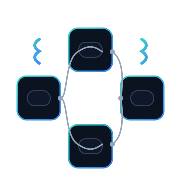

<p align="Center"></p>
<h4 align="Center">0SH - Structure de données</h4>

# 🏋🏻‍♂️ Exercices 02 - Les classes

## Section 1 - Structurer une classe

### 🐱 Question 01 - Cat Structure

Créez une classe `Cat` respectant le principe d'encapsulation, qui permettra de créer 3 objets en mémoire avec les données de chats célèbres :

#### Affichage requis :

```plaintext
Nom : Garfield, Poids : 6.8 kg
Nom : Tom, Poids : 4.5 kg
Nom : Felix, Poids : 3.9 kg
```

> Astuce: Créer une fonction réutilisable nommée `displayCat()` d'affichage d'un seul `Cat`.

### 🐱 Question 02 - Cats Party

Utilisant la classe `Cat`, chargez la [base de données des chats](_bin/cats.dat) en mémoire à partir de la fonction `loadCatsFromFile()` que vous allez créer et affichez les chats à l'écran.

```C++
const string CATS_FILE = "cats.dat";

void loadCatsFromFile(vector<Cat>& cats) {
  //Complétez le code ici
}


void displayCats(const vector<Cat>& cats) {
	// Boucle de type foreach qui 'fournit' chacun
	// des chats individuellement dans la variable `cat`.
	for (const Cat& cat : cats) {
		displayCat(cat);
	}
}

void question02() {
	vector<Cat> cats;       // Création d'une structure de données de type vecteur.
	loadCatsFromFile(cats); // Charger la base de données de chats en mémoire.
	displayCats(cats);      // Fonction d'affichage des données de chats en mémoire.
}
```

#### Affichage requis :

```plaintext
Nom : SinaZoomC, Poids : 8.38 kg
Nom : TefimiSnowE, Poids : 10.73 kg
Nom : SuchaStripeM, Poids : 13.95 kg
Nom : ChanutiCleoC, Poids : 14.27 kg
Nom : LukiTigerG, Poids : 14.23 kg
...
```

> Considérez ici que vous ne connaissez pas le nombre de chats dans le fichier de données. Informez-vous sur la fonction `eof()` de `ifstream`.

> Information : Il est possible de créer plus d'un **constructeur** dans une classe.

### 🐱 Question 03 - Cats Safety

Par mesure de prévention, nous allons insérer une puce électronique miniature à l'arrière de l'oreille de chacun des chats. Vous êtes responsable de créer un "système" de numérotation original appartenant à la **classe** `Cat`.

Vous procéderez ensuite au pucage de chacun des chats en mémoire et les afficherez à l'écran.

> Utilisez votre créativité afin de réaliser ce numéro.

### 🐱🐱🐱 DÉFI - Question 04 - Cats Unicity

Reprenez le résultat de la `Question 03` et générez réellement des objets `microchip` en mémoire.

Pucez ensuite chacun des chats individuellement avant de les injecter dans les chats en s'assurant de l'unicité des puces.

Modifiez maintenant à distance, le code d'une micropuce (en modifiant la `microchip`) et validez que le chat répond bel et bien à ce nouveau numéro de puce.

# Section #2 - Surcharge d'opérateurs

### 😎 Question 05 - Self Esteem

Cédrik Dubogue, votre contact chez votre principal client, vous envoie cette [base de données](./_bin/items.dat) et vous demande de terminer le code permettant l'affichage à l'écran.

```c++
void displayItems(const vector<Item>& items) {
	cout << left  << setw(10) << "SKU"
		 << left  << setw(50) << "Produit"
		 << right << setw(10) << "Prix" << endl;
	cout << string(71, '-') << endl;
	for (const Item& item : items) {
		cout << item << endl;
	}
}

void question05() {
	vector<Item> items;
	loadItemsFromFile(items);
	displayItems(items);
}
```

#### Affichage requis :

```plaintext
SKU       Produit                                                 Prix
-----------------------------------------------------------------------
4829017   Apple MacBook Air 13-inch (M2 2022)                  1199.00$
7301462   Apple MacBook Pro 14-inch (M3)                       1999.00$
1058934   Dell XPS 13 (9315)                                   1299.00$
6942175   Lenovo ThinkPad X1 Carbon Gen 11                     1799.00$
[...]
3609817   Intel NUC 11 Pro Kit (NUC11TNKi5)                     499.00$
5921764   Mac mini (M2)                                         599.00$
8175039   Synology DiskStation DS220+ NAS                       299.00$
2468091   Synology DiskStation DS923+ NAS                       599.00$
```

### ⚖️ Question 06 - Comparatif

Afin d'être en mesure de planifier ses livraisons, CDInformatique Inc. doit être en mesure de comparer deux produits basés sur le poids. Deux produits sont considérés égaux si leur différence de poids n'exède pas 500g.

Ajoutez les surcharges d'opérateurs `<, == et >` permettant de comparer des produits entre eux.

```plaintext
Entrez la comparaison (exemple 4829017 > 7301462) : 4829017 > 7301462
Cette comparaison est fausse !
```

```plaintext
Entrez la comparaison (exemple 4829017 > 7301462) : 4829017 = 7301462
Cette comparaison est vraie !
```

```plaintext
Entrez la comparaison (exemple 4829017 > 7301462) : 4829017 > 7301462
Cette comparaison est fausse !
```

Votre code principal doit pouvoir comparer des produits avec un code semblant à :

```cpp
boolean compare = items[0] > items[1];
```

### 📦 DÉFI Question 07 - Packages

Vous venez de recevoir ce courriel :

> Bonjour,
>
> Jusqu'au _Black Friday_, nous voulons offrir des packages formés de 2 produits ou plus à nos clients et offrir ce **produit** à 10% de rabais.
>
> Notre préposé aux ventes sera en charge de créer les packages en entrant les numéros de SKU manuellement. Pour ne pas se casser la tête, nous souhaitons que le nom du package soit simplement `PACKAGE #X`. Pour le SKU du package ainsi créé, vous êtes libre de nous proposer une solution car cela nous importe peu étant donné que le package sera temporaire.
>
> Nous aimerions que les clients puissent choisir ces nouveaux **produits** sans rien changer au code du site web en cours. Donc, de ce côté, vous n'aurez rien à faire !
>
> Merci de nous revenir avec une preuve de concept fonctionnelle,
>
> Cordialement,
>
> Cédrik Dubois
> CDInformatique Inc.

#### Votre mandat

1. Lire attentivement le courriel en mettant de l'importance sur les mots en gras.
2. Effectuer une analyse du besoin et des fonctions à créer ainsi que de leur rôle et **présenter votre résultat à l'enseignant avant de programmer**.
3. Programmer la preuve de concept.
4. Trouver une méthode rapide de tester le résultat.

#### Important à savoir
Vous devrez utiliser un pointeur afin d'être en mesure de surcharger l'opérateur `+=`.
```cpp
Item& operator+=(const Item& other) {
	// Votre code ici !
	return *this;
}
```
> ATTENTION : L'utilisation détaillée des pointeurs sera présentée sous peu.

<hr><p align="Center"></p>
