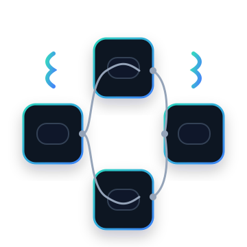

<p align="center"></p>
<h4 align="center">0SH - Structure de données</h4>

# 🏋🏻‍♂️ Exercices 03 - La Stack

## 📚 Question 1 - Using Stack

Il existe, dans la librairie `stack`, une structure de données de type pile (`stack`). En C++, elle se nomme justement `stack<[TYPE]>`, où `[TYPE]` est le type de donnée à stocker (`int`, `char`, `Planet`, `Point`). Par exemple, afin de déclarer une pile de nombres entiers, nous ferons :

```cpp
stack<int> numbers;
```

La variable `numbers` est maintenant apte à enregistrer des données dans une pile grâce à ces méthodes :
1. `push` : ajouter un élément sur la pile.
2. `pop` : retirer un élément de la pile (sans le retourner).
3. `top` : consulter (retourner) l'élément au-dessus de la pile.
4. `size` : retourner le nombre d'éléments sur la pile.
5. `empty` : indiquer si la pile est vide (synonyme de `size == 0`).

### 1.1 Fonction displayStackStatus()
Débutez votre solution en créant une fonction servant à afficher l'état de la pile, nommée `displayStackStatus()`.

Voici une __simulation__ d'exemples d'affichage dans le contexte où l'espace disponible dans la `stack` serait de 10 nombres :
```plaintext
La pile est vide.
```
```plaintext
La pile est utilisée.
Il y a 9 nombres en mémoire.
Le dernier nombre entré est 25.
```
```plaintext
La pile est utilisée.
Il y a 10 nombres en mémoire.
Le dernier nombre entré est 63.
```
> ⚠️ Vous n'arriverez probablement pas à remplir la `stack` de base, mais prévoyez cette option pour plus tard.

### 1.2 L'algorithme principal
1. Affichez l'état de la pile.
2. Ajoutez 25 nombres aléatoires dans la pile, entre 1000 et 2000.
3. Affichez l'état de la pile.
4. Affichez les 5 derniers nombres entrés dans la pile.
5. Additionnez les 10 prochains nombres de la pile dans une variable `sum`.
6. Affichez la valeur de `sum`.
7. Affichez l'état de la pile.
8. En utilisant obligatoirement une boucle `while() {}`, retirez les nombres restants de la pile.
9. Affichez l'état de la pile.

#### Exemple d'affichage final convenable :
```plaintext
Question 01
--------------------------------------------------
#1 - État de la pile
   ----------------------------------------------
   La pile est vide.

#2 - Ajout des nombres aléatoires dans la pile :

#3 - État de la pile
   ----------------------------------------------
   La pile est utilisée.
   Il y a 25 nombres en mémoire.
   Le dernier nombre entré est 1292.

#4 - Retrait et utilisation de 5 nombres de la pile :
Le nombre [1292] sera retiré de la pile.
Le nombre [1153] sera retiré de la pile.
Le nombre [1899] sera retiré de la pile.
Le nombre [1590] sera retiré de la pile.
Le nombre [1359] sera retiré de la pile.

#5 - Addition des 10 prochains nombres de la pile :
#6 - Le total des 10 nombres retirés est 16507.

#7 - État de la pile
   ----------------------------------------------
   La pile est utilisée.
   Il y a 10 nombres en mémoire.
   Le dernier nombre entré est 1440.

#8 - Vidage de la pile :
#9 - État de la pile
   ----------------------------------------------
   La pile est vide.
```

Voilà, vous maîtrisez suffisamment le fonctionnement des piles. Passons maintenant à l'apprentissage de la création de la structure de données...

## 📚 Question 2 - StackIT
L'idée ici, c'est de créer une structure de données de pile plus pratique que `stack`, qui, selon moi :
1. devrait retourner l'entité retirée lors du déclenchement de `pop()`;
2. devrait être en mesure d'avertir que la pile est pleine avec `full()`.

Nous utiliserons alors un tableau statique (régulier) d'une taille de 69 caractères afin de créer une structure de données nommée `StackIT`, enregistrant des données de type `char`. Cette classe devra avoir les mêmes méthodes que la classe `stack` de C++, en y ajoutant les deux qui manquent.

Pour des raisons pédagogiques, nous considérerons que `-1` représente `vide`. Retournez donc `EMPTY` dans les fonctions qui nécessitent de retourner une valeur, même si la pile est vide.
```cpp
const int EMPTY = -1;
```

## 🙃 Question 3 - Le monde à l'envers

En utilisant obligatoirement la pile créée en question 2, affichez à l'endroit ces messages :
#### Message #1
```plaintext
!!!seennod ed erutcurts ereimerp am eriurtsnoc ed rissuer ed sneiv eJ
```

> ⚠️ Il est normal ici, pour des raison de complexité, de ne pas avoir d'accent dans les messages.
> 
Est-ce que votre algorithme ainsi que votre classe `StackIT` sont assez robustes pour ne pas planter en utilisant le message suivant ?
#### Message #2
```plaintext
.eiv iarv al snad selitu tnores suov iuq secicrexe sed reerc ed ecroffe's tnangiesne'L
```

### Résultats à prévoir
Normalement, votre code dans l'algorithme devrait bloquer toute tentative d'ajout dans `StackIT` si elle est pleine.  
Si aucune prévalidation n'est effectuée, au moins `StackIT` devrait vous retourner des messages d'erreur.

##### Avec validation dans l'algorithme principal
```plaintext
Message #2
--------------
nant s'efforce de creer des exercices qui vous seront utiles dans la vrai vie.
```

##### En laissant la pile faire le travail d'urgence
```plaintext
Message #2
--------------
Erreur, la pile est pleine! Impossible d'y ajouter [103].
Erreur, la pile est pleine! Impossible d'y ajouter [105].
Erreur, la pile est pleine! Impossible d'y ajouter [101].
Erreur, la pile est pleine! Impossible d'y ajouter [115].
Erreur, la pile est pleine! Impossible d'y ajouter [110].
Erreur, la pile est pleine! Impossible d'y ajouter [101].
Erreur, la pile est pleine! Impossible d'y ajouter [39].
Erreur, la pile est pleine! Impossible d'y ajouter [76].
Erreur, la pile est pleine! Impossible d'y ajouter [0].
nant s'efforce de creer des exercices qui vous seront utiles dans la vrai vie.
```

Comment faire pour que le deuxième message s'affiche bien sans rien changer dans l'algorithme __principal__ (code de `question03()`) ?

> Indice: Repoussez les limites !

## ✔️ Question 4 - Code validator

Dans cette question, vous devez utiliser la pile afin de valider si les codes suivants contiennent un nombre équilibré d'accolades ouvrantes et fermantes, et ce, dans une fonction `validateCodeIntegrity()`.

#### Variable `string` sur plusieurs lignes
Ajoutez un `R` avant les guillemets du début de la chaîne et placez le texte qui est entre les guillemets également entre `(` et `)`. Vous aurez alors une chaîne de caractères linéaire, comme à l'habitude, mais écrite sur plusieurs lignes pour plus de visibilité dans le code. Exemple :

```cpp
string code1 = R"(if(age >= 18) {...})";
```

##### Exemple
```cpp
for (int i = 0; i < COUNT; i++) {
  numberStack.push((rand() % (MAX - MIN + 1)) + MIN);
}
```

...sera placé dans une string sur plusieurs lignes :
```cpp
const string code =
R"(for (int i = 0; i < COUNT; i++) {
  numberStack.push((rand() % (MAX - MIN + 1)) + MIN);
})";
```

### Liste des codes à valider
#### Code #1

```cpp
if(age >= 18) {
   if(hasExperience) {
      cout << "Oui vous pouvez travailler dans ma micro-brasserie !";
   }
}
```

```plaintext
Ce code est équilibré !
```

#### Code #2

```cpp
if(age >= 18) {
   if(!hasExperience) {
      cout << "Je suis désolé, je cherche quelqu'un avec expérience !"
   }}
}
```

```plaintext
Il y a trop d'accolades fermantes !
```

#### Code #3

```cpp
if(age >= 18) {
   if(hasExperience) {
      {cout << "Oui vous pouvez travailler dans ma micro-brasserie !"
   }
}
```

```plaintext
Il y a trop d'accolades ouvrantes !
```

## DÉFI ✔️ Code Formatter

Certains étudiants oublient parfois de formater leur code avant de remettre leurs travaux. Aidez ces étudiants à avoir du code propre en créant la fonction `formatCode()`.

##### Règles activées dans le plug-in de formatage :
1. Indentation du code de deux espaces par imbrication;
2. DOUBLE-DÉFI : formatez les conditions (`if`, `while`, `for`) exactement comme ceci :
```cpp
if (age >= 18) {
  if (!hasExperience) {
    //...
  }
}
```

### Suggestions
1. Créez d'abord le code corrigé dans une variable de sortie.
2. Affichez ensuite cette variable à l'écran.

#### Code à formater
```cpp
void getSKU() {
int count = 0;
string sku = "";
cout << "Entrez les 5 chiffres du code de produit (SKU) [Exemple: 76754] : ";
while(count != 5){
char input = _getch();
if(input >= '0' && input <= '9'){
cout << input;
sku += input;
count++;
}
};
cout << endl << "Le produit #" << sku << " a été ajouté au panier.";
}
```
<hr/>
<p align="center"></p>

