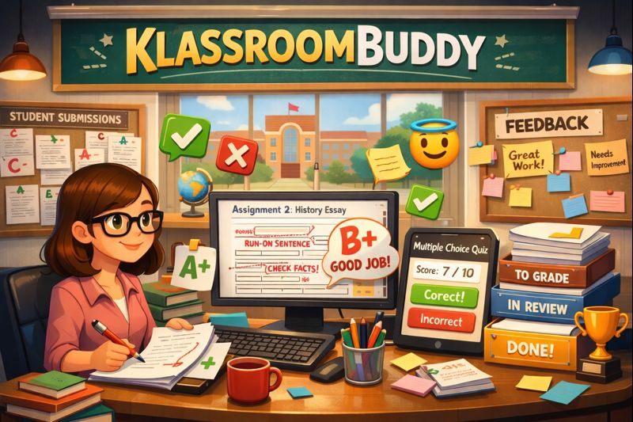

<h1 align="Center">👩🏻‍🏫 KlassroomBuddy 👨🏻‍🏫</h1>
<h2 align="Center">Présenté par RétroAction Inc.🪃</h2>

## Votre défi

Vous avez été mandaté par l'entreprise **RétroAction** afin de compléter une application déjà entamée qui va compétitionner avec **Omnivox**.  Yvan Dusoft, le représentant de l'entreprise souhaite pouvoir consulter les résultats des étudiants des salles de classe provenants de fichiers de données.

voir s'exécuter une petite application capable de lire des données provenant d'un fichier texte afin d'afficher les résultats des salles de classe à l'écran.

Cédrik Dubois, le programmeur qui a commencé le projet, vous a informé que les données comportent les entités `Classroom` (salle de classe), `Assessment` (évaluations du plan de cours), `Correction` (correction d'une évaluation d'un étudiant) ainsi que `Student` (étudiant).

## Instructions
1.

