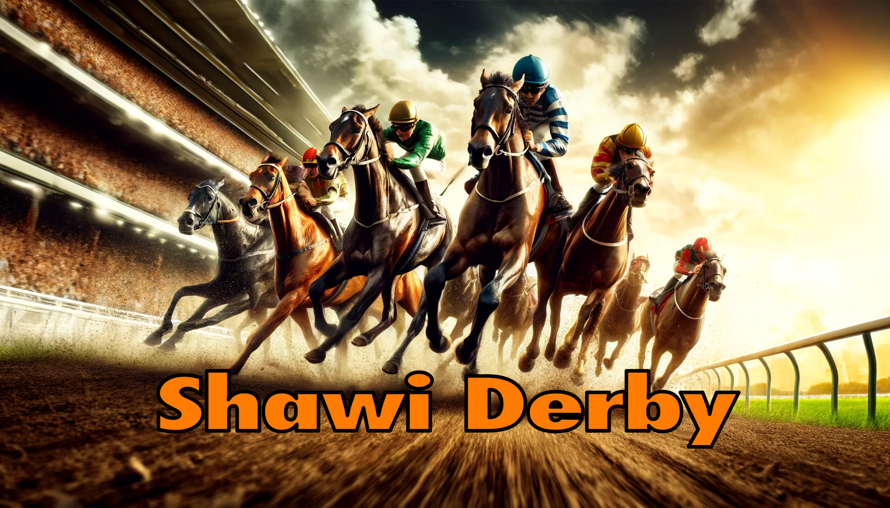
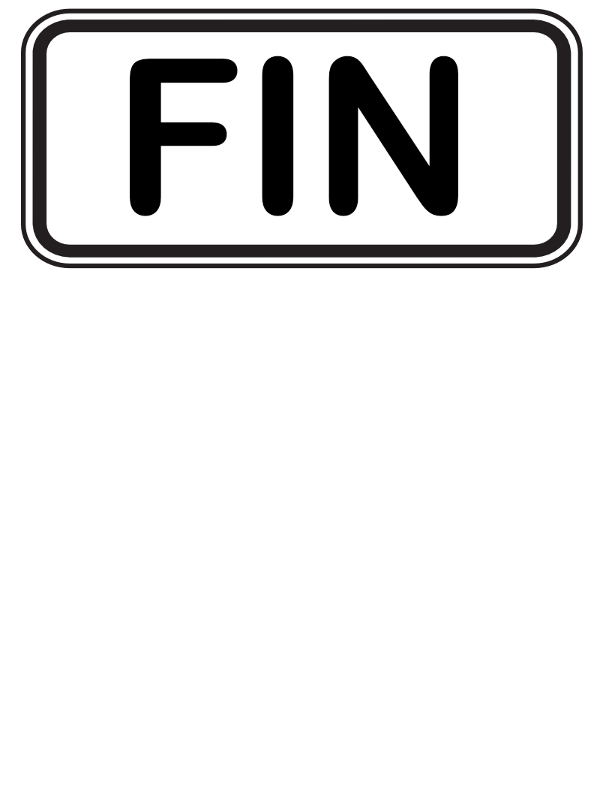

<p align="Center"></p>
<h5 align="Center">1Q2 - Programmation structurée</h5>

# TP2 - The Shawi Derby (5%)
<p align="Center"></p>

## Introduction
Il existe plusieurs courses de chevaux de renommée dans le monde que nous appelons des `derby`.  L'idée de ce travail pratique c'est de faire une mini application qui simulera une saison de course (les derby) et qui affichera par la suite les résultats de cette saison.

## Écran d'accueil
```plaintext
*************************************************************
*             Championnat du monde de Derby                 *
*************************************************************
*       Appuyez sur ESPACE pour lancer la saison...         *
*************************************************************
```
- Affichage de cet écran d'accueil où il est `obligatoire` d'appuyer sur ESPACE pour pouvoir continuer.

## Lancement d'une course (derby)
```plaintext
*******************************************************
 Course 1/5 Dubai World Cup - Émirats Arabes Unis
*******************************************************
Cheval #1: ----------->         |
Cheval #2: ------------>        |
Cheval #3: ---------->          |
Cheval #4: --------------->     |
Cheval #5: ----------->         |
Cheval #6: -------------------->|
Cheval #7: ----------->         |
Cheval #8: -------------->      |
Cheval #9: ------------------>  |

Le cheval #6 a gagné la course !

Appuyez sur ESPACE pour lancer le Kentucky Derby - États-Unis
```
- Affichage du numéro de la course et du total des courses du championnat.
- Affichage du nom du derby en cours.
- Affichage des 9 chevaux en course et de leur avancement par rapport à la longueur de la piste (qui doit être paramétrable en code ce qui veut dire de créer une constante `const` du bon type).
- Quand un cheval à atteint le fil d'arrivée, afficher le gagnant et le message de poursuite vers le prochain derby (s'il y en a un autre).
- L'utilisateur doit `obligatoirement` entrer ESPACE pour continuer et on recommence un nouvelle course avec un nouveau nom de derby.
  
 

## Affichage des résultats
1. Option #1: Afficher seulement les gagnants de chacune des courses.
2. Option #2: [1pt bonus] Afficher un classement mondial des chevaux pour le championnat de saison avec une distribution des points de votre cru.

### Résultats - Option 1 - Affichage des gagnants
```plaintext
*************************************************************
*     Championnat du monde de Derby - Liste des gagnants    *
*************************************************************
Course #1: Cheval #6  Dubai World Cup - Émirats Arabes Unis
Course #2: Cheval #1  Kentucky Derby - États-Unis
Course #3: Cheval #8  Prix de l'Arc de Triomphe - France
Course #4: Cheval #5  Royal Ascot - Royaume-Uni
Course #5: Cheval #5  Melbourne Cup - Australie
```

### Résultats - Option 2 - Affichage des résultats de la saison
```plaintext
*************************************************************
*     Championnat du monde de Derby - Résultats    *
*************************************************************
Position #1   Cheval #6   20 points
Position #2   Cheval #9   15 points
Position #3   Cheval #1   14 points
Position #4   Cheval #2   12 points
Position #5   Cheval #3   12 points
Position #6   Cheval #8   09 points
Position #7   Cheval #4   05 points
Position #8   Cheval #7   04 points
Position #9   Cheval #5   03 points
```
## Données de base à utiliser
Pour votre développement nous utilisesons ces données :
```cpp
//Liste des Derbies dans le championnat du monde
const string derbies[5] = {
"Dubai World Cup - Émirats Arabes Unis",
"Kentucky Derby - États-Unis",
"Prix de l'Arc de Triomphe - France",
"Royal Ascot - Royaume-Uni",
"Melbourne Cup - Australie"
};
```
 > ATTENTION: Il y aura un nombre différent de derby lors de la correction et votre code doit toutefois bien fonctionner sans autre changement.

## Vidéo d'une saison

> ATTENTION: Ne pas tenir compte du vacillement de l'écran lors de l'avancemenet d'un cheval.  Il existe deux méthodes d'affichage à l'écran et comme je vous demande la plus simple, ce sintillement est normal et acceptable (limitation de la console).

## Critère à respecter
- Il est **interdit** d'utiliser des vecteurs pour ce travail pratique, seuls les tableaux statiques seront permis sous peine de rejet de la remise.
- Tout ce que vous codez doit être présent à un endroit ou à un autre dans les notes de cours ou sur Omnivox.
  - Il est **interdit** d'utiliser des fonctions C++ autres que celles présentées en classe.

## Grille d'auto correction

| #   | Critère                                                            | Pts |
| --- | ------------------------------------------------------------------ | ------ |
| 01  | Fonctionnement de l'écran principal |  0.5   |
| 02  | Capacité d'exécuter / fonctionnement d'une course unique | 1  |
| 03  | Capacité d'exécuter / fonctionnement de toute la saison (données de l'enseignant) en boucle |  1  |
| 04  | Affichage des gagnants de la saison |  1  |
| 05  | Noms de variables significatifs |  0.5   |
| 06  | Qualité, efficacité et clarté du code|  0.5  |
| 07  | Affichage identique  |  0.5     |
|  P   | Présence de fonctions interdites (par fonction) | -1 |
|     | **TOTAL**                                                              | **5** |


<p align="Center"></p>